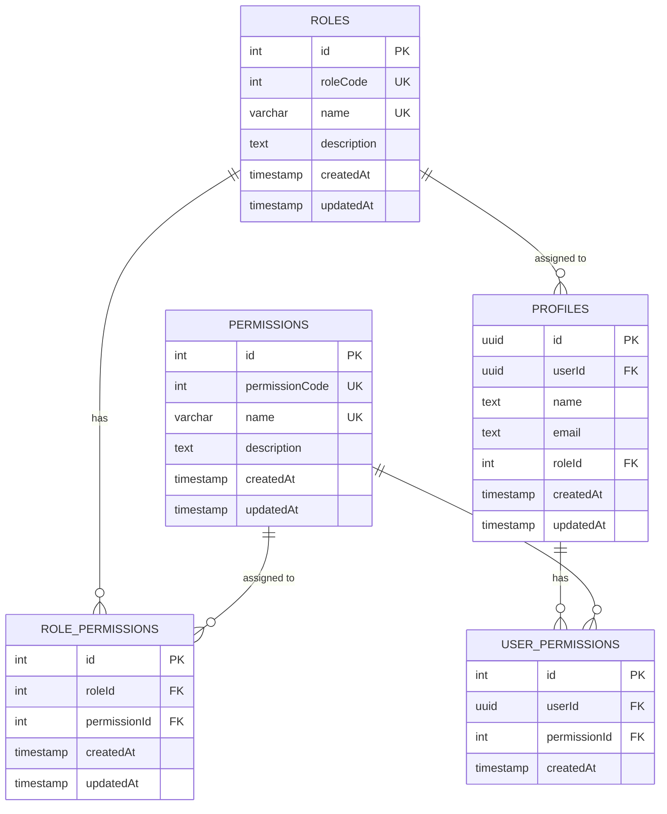

# ER 図

## ロール（権限）周り

```mermaid
erDiagram
    ROLES {
        int id PK
        int roleCode UK
        varchar name UK
        text description
        timestamp createdAt
        timestamp updatedAt
    }
    
    PERMISSIONS {
        int id PK
        int permissionCode UK
        varchar name UK
        text description
        timestamp createdAt
        timestamp updatedAt
    }
    
    ROLE_PERMISSIONS {
        int id PK
        int roleId FK
        int permissionId FK
        timestamp createdAt
        timestamp updatedAt
    }
    
    PROFILES {
        uuid id PK
        uuid userId FK
        text name
        text email
        int roleId FK
        timestamp createdAt
        timestamp updatedAt
    }
    
    USER_PERMISSIONS {
        int id PK
        uuid userId FK
        int permissionId FK
        timestamp createdAt
    }
    
    ROLES ||--o{ ROLE_PERMISSIONS : "has"
    PERMISSIONS ||--o{ ROLE_PERMISSIONS : "assigned to"
    ROLES ||--o{ PROFILES : "assigned to"
    PROFILES ||--o{ USER_PERMISSIONS : "has"
    PERMISSIONS ||--o{ USER_PERMISSIONS : "assigned to"
```