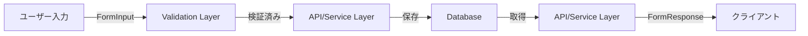

# スキーマ命名規則 (Schema Naming Convention)

本プロジェクトにおけるスキーマと型定義の命名規則を定義します。

## 概要

プロジェクトは2つの明確なレイヤーで構成されており、各レイヤーごとに一貫した命名規則を適用します：

1. **Validation Layer（バリデーション層）**: ユーザー入力の検証
2. **API Layer（API層）**: API通信のデータ構造

この規則により、コードの可読性と保守性を向上させ、ブラウザAPIとの名前衝突を防ぎます。

## 命名規則一覧

### 1. Validation Layer (バリデーション層)

**場所**: `app/models/[entity].ts`

**目的**: フォーム入力や外部からのデータのバリデーション

| 要素 | 命名パターン | 例 |
|------|-------------|-----|
| スキーマ | `[Entity]InputSchema` | `FormInputSchema` |
| 型 | `[Entity]Input` | `FormInput` |

**使用例**:

```typescript
// app/models/forms.ts
import { z } from "zod";

export const FormInputSchema = z.object({
  title: z.string().min(1).max(200),
  description: z.string().max(1000).optional(),
  status: z.enum(["draft", "published"]),
});

export type FormInput = z.infer<typeof FormInputSchema>;
```

**用途**:
- フォーム送信時のバリデーション
- ユーザー入力の検証
- API受信データの検証

### 2. API Layer (API層)

**場所**: `app/services/[feature]/schemas.ts`

**目的**: API通信のレスポンス/リクエストデータの型定義

#### 2.1 APIレスポンス

| 要素 | 命名パターン | 例 |
|------|-------------|-----|
| スキーマ | `[Entity]ResponseSchema` | `FormResponseSchema` |
| 型 | `[Entity]Response` | `FormResponse` |

**使用例**:

```typescript
// app/services/forms/schemas.ts
import { z } from "zod";

export const FormResponseSchema = z.object({
  id: z.string(),
  title: z.string(),
  description: z.string().nullable(),
  status: z.enum(["draft", "published"]),
  created_at: z.string(),
  updated_at: z.string().nullable(),
});

export type FormResponse = z.infer<typeof FormResponseSchema>;
```

**用途**:
- APIレスポンスのバリデーション
- データベースから取得したデータの型定義
- クライアントへ返すデータの構造定義

#### 2.2 APIリクエストパラメータ

| 要素 | 命名パターン | 例 |
|------|-------------|-----|
| スキーマ | `[Entity]ParamsSchema` | `FormsListParamsSchema` |
| 型 | `[Entity]Params` | `FormsListParams` |

**使用例**:

```typescript
// app/services/forms/schemas.ts
export const FormsListParamsSchema = z.object({
  offset: z.number().default(0),
  limit: z.number().default(10),
});

export type FormsListParams = z.infer<typeof FormsListParamsSchema>;
```

**用途**:
- クエリパラメータのバリデーション
- ページネーション設定
- フィルター条件の型定義

#### 2.3 APIレスポンス全体

| 要素 | 命名パターン | 例 |
|------|-------------|-----|
| スキーマ | `[Entity]ListSchema` | `FormsListSchema` |
| 型 | `[Entity]ListResponse` | `FormsListResponse` |

**使用例**:

```typescript
export const FormsListSchema = z.object({
  success: z.boolean(),
  data: z.array(FormResponseSchema).nullable(),
  error: z.object({
    code: z.string(),
    message: z.string(),
  }).optional(),
  status: z.number(),
});

export type FormsListResponse = z.infer<typeof FormsListSchema>;
```

## レイヤー間のデータフロー



## 新しいエンティティの追加ガイド

新しいエンティティ（例：`User`）を追加する場合の手順：

### 1. Validation Layer (必須)

```typescript
// app/models/users.ts
import { z } from "zod";

export const USER_STATUS = {
  ACTIVE: "active",
  INACTIVE: "inactive",
} as const;

export type UserStatus = (typeof USER_STATUS)[keyof typeof USER_STATUS];

export const UserInputSchema = z.object({
  name: z.string().min(1).max(100),
  email: z.string().email(),
  status: z.enum([USER_STATUS.ACTIVE, USER_STATUS.INACTIVE]),
});

export type UserInput = z.infer<typeof UserInputSchema>;
```

### 2. API Layer (必須)

```typescript
// app/services/users/schemas.ts
import { z } from "zod";
import { USER_STATUS } from "~/models/users";

export const UserResponseSchema = z.object({
  id: z.string(),
  name: z.string(),
  email: z.string(),
  status: z.enum([USER_STATUS.ACTIVE, USER_STATUS.INACTIVE]),
  created_at: z.string(),
  updated_at: z.string().nullable(),
});

export type UserResponse = z.infer<typeof UserResponseSchema>;

export const UsersListParamsSchema = z.object({
  offset: z.number().default(0),
  limit: z.number().default(10),
  status: z.enum([USER_STATUS.ACTIVE, USER_STATUS.INACTIVE]).optional(),
});

export type UsersListParams = z.infer<typeof UsersListParamsSchema>;
```

## 命名規則の理由

### なぜこの規則を採用したか

1. **役割の明確化**
   - `Input` = ユーザー入力
   - `Response` = APIレスポンス
   - `Params` = リクエストパラメータ
   - 名前から用途が即座に判断できる

2. **ブラウザAPIとの衝突回避**
   - 旧名称 `FormData` はブラウザネイティブの `FormData` APIと衝突
   - `FormResponse` に変更することで混乱を防止

3. **スケーラビリティ**
   - 新しいエンティティ追加時に一貫したパターンを適用可能
   - チーム全体で同じ命名ルールを共有

4. **TypeScript型安全性**
   - Zodの `z.infer` を活用し、スキーマと型を自動同期
   - 型定義の重複を排除

## ベストプラクティス

### DO ✅

- **レイヤーごとに適切な接尾辞を使用する**
  ```typescript
  // Good
  const UserInputSchema = z.object({...});
  const UserResponseSchema = z.object({...});
  ```

- **定数はエンティティモデルで定義する**
  ```typescript
  // app/models/users.ts
  export const USER_STATUS = {
    ACTIVE: "active",
    INACTIVE: "inactive",
  } as const;
  ```

- **型はスキーマから推論する**
  ```typescript
  export type UserInput = z.infer<typeof UserInputSchema>;
  ```

### DON'T ❌

- **レイヤー間で型定義を重複させない**
  ```typescript
  // Bad - 重複している
  // app/models/users.ts
  export type UserInput = { name: string; email: string; }

  // app/services/users/schemas.ts
  export type UserInput = { name: string; email: string; } // ❌ 重複
  ```

- **曖昧な命名を避ける**
  ```typescript
  // Bad - 用途が不明
  const UserSchema = z.object({...}); // ❌ Input? Response?
  const UserData = z.object({...});   // ❌ 曖昧
  ```

- **ブラウザAPIと衝突する名前を使わない**
  ```typescript
  // Bad
  export type FormData = {...}; // ❌ ブラウザのFormDataと衝突
  ```

## トラブルシューティング

### Q: InputとResponseで同じフィールド構造の場合、スキーマを共有できますか？

A: **いいえ、推奨しません。** レイヤーごとに独立したスキーマを定義すべきです。

理由：
- 将来的にレイヤーごとに異なるバリデーションが必要になる可能性
- Inputにはidやtimestampが不要だが、Responseには必要
- 明確な関心の分離

### Q: 既存のエンティティでこの規則に従っていないものはどうすればいいですか？

A: 段階的にリファクタリングを推奨します。

1. 新しいスキーマ名で定義を追加
2. 徐々に使用箇所を移行
3. 旧スキーマを削除

### Q: サードパーティAPIのレスポンスはどう扱いますか？

A: 専用のスキーマを定義することを推奨します。

```typescript
// app/services/external/github/schemas.ts
export const GitHubUserResponseSchema = z.object({
  id: z.number(),
  login: z.string(),
  // GitHub APIのレスポンス構造に従う
});

export type GitHubUserResponse = z.infer<typeof GitHubUserResponseSchema>;
```

## 参考資料

- [Zod Documentation](https://zod.dev/)
- プロジェクトSOW: `.claude/workspace/sow/20260105095220-form-schema-refactoring/sow.md`

## 変更履歴

| 日付 | バージョン | 変更内容 |
|------|-----------|---------|
| 2026-01-05 | 1.0.0 | 初版作成。Validation/API 2層の命名規則を確立 |

---

**メンテナンス**: このドキュメントは命名規則の変更時に必ず更新してください。
