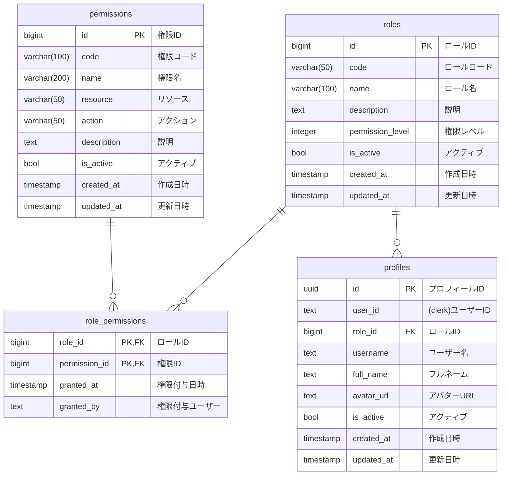

# Profiles ER図

```mermaid
erDiagram

  roles {
    bigint id PK "ロールID"
    varchar(50) code "ロールコード"
    varchar(100) name "ロール名"
    text description "説明"
    integer permission_level "権限レベル"
    bool is_active "アクティブ"
    timestamp created_at "作成日時"
    timestamp updated_at "更新日時"
  }

  permissions {
    bigint id PK "権限ID"
    varchar(100) code "権限コード"
    varchar(200) name "権限名"
    varchar(50) resource "リソース"
    varchar(50) action "アクション"
    text description "説明"
    bool is_active "アクティブ"
    timestamp created_at "作成日時"
    timestamp updated_at "更新日時"
  }

  role_permissions {
    bigint role_id PK,FK "ロールID"
    bigint permission_id PK,FK "権限ID"
    timestamp granted_at "権限付与日時"
    text granted_by "権限付与ユーザー"
  }

  profiles {
    uuid id PK "プロフィールID"
    text user_id "(clerk)ユーザーID"
    bigint role_id FK "ロールID"
    text username "ユーザー名"
    text full_name "フルネーム"
    text avatar_url "アバターURL"
    bool is_active "アクティブ"
    timestamp created_at "作成日時"
    timestamp updated_at "更新日時"
  }

  roles ||--o{ role_permissions : ""
  permissions ||--o{ role_permissions : ""
  roles ||--o{ profiles : ""
```