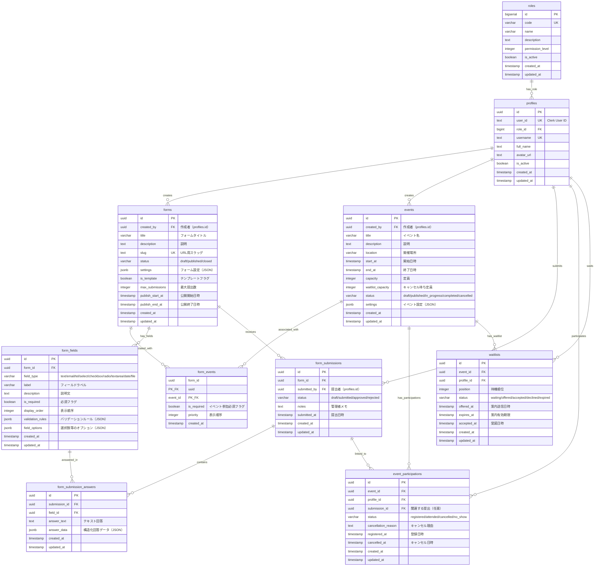

# pukusapo フォーム・イベント管理システム ER図

## ER図

## テーブル概要

### 既存テーブル
- **profiles**: ユーザープロフィール情報
- **roles**: ユーザーロール（RBAC）

### 新規テーブル

#### フォーム関連
- **forms**: フォームの基本情報（タイトル、説明、公開状態など）
- **form_fields**: フォームの入力項目（項目タイプ、ラベル、バリデーションなど）
- **form_submissions**: フォームの提出記録
- **form_submission_answers**: 各項目への回答内容

#### イベント関連
- **events**: イベントの基本情報（タイトル、日時、場所、定員など）
- **event_participations**: イベントへの参加状況
- **waitlists**: イベントのキャンセル待ちリスト

#### 関連テーブル
- **form_events**: フォームとイベントの多対多関連（複合主キー：form_id, event_id）

## 主要なリレーションシップ

### ユーザー関連
- ユーザー（profiles）は複数のフォームを作成できる（1対多）
- ユーザー（profiles）は複数のイベントを作成できる（1対多）
- ユーザー（profiles）は複数のフォームを提出できる（1対多）
- ユーザー（profiles）は複数のイベントに参加できる（1対多）

### フォーム・イベント関連
- フォームとイベントは多対多の関係（form_eventsを介する）
- 1つのフォームは複数のイベントに紐付けられる
- 1つのイベントは複数のフォームに紐付けられる

### 提出・回答関連
- フォーム提出（form_submissions）は複数の回答（form_submission_answers）を持つ（1対多）
- フォーム提出は複数のイベント参加（event_participations）に紐付けられる（1対多）

### 定員管理
- イベント（events）は複数の参加者（event_participations）を持つ（1対多）
- イベント（events）は複数のキャンセル待ち（waitlists）を持つ（1対多）
